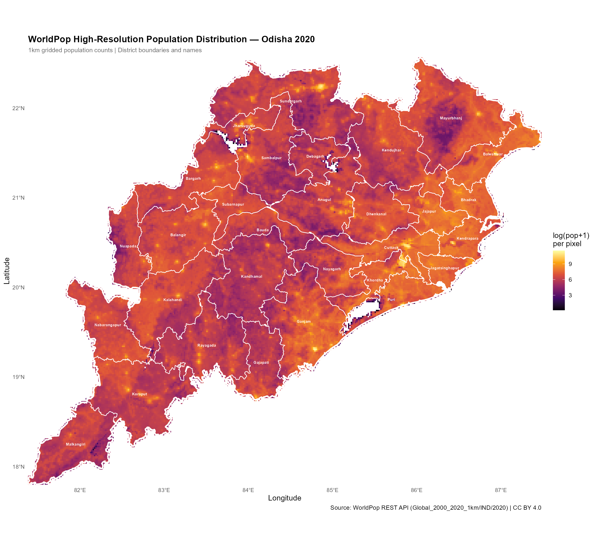
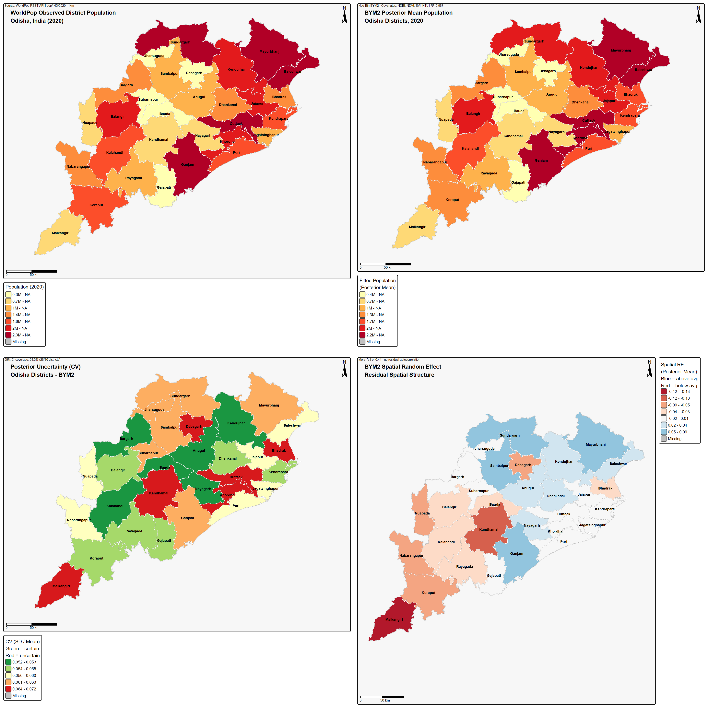
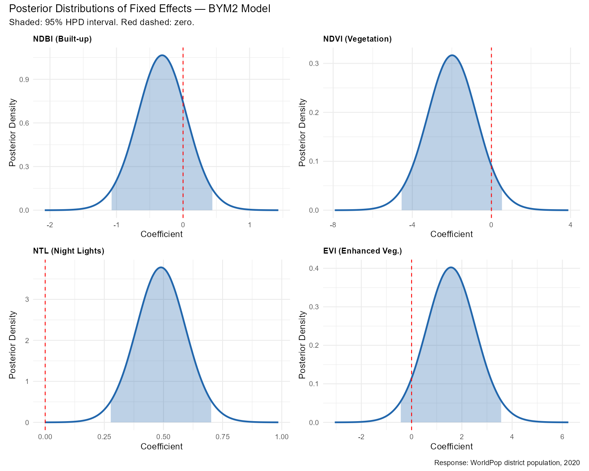
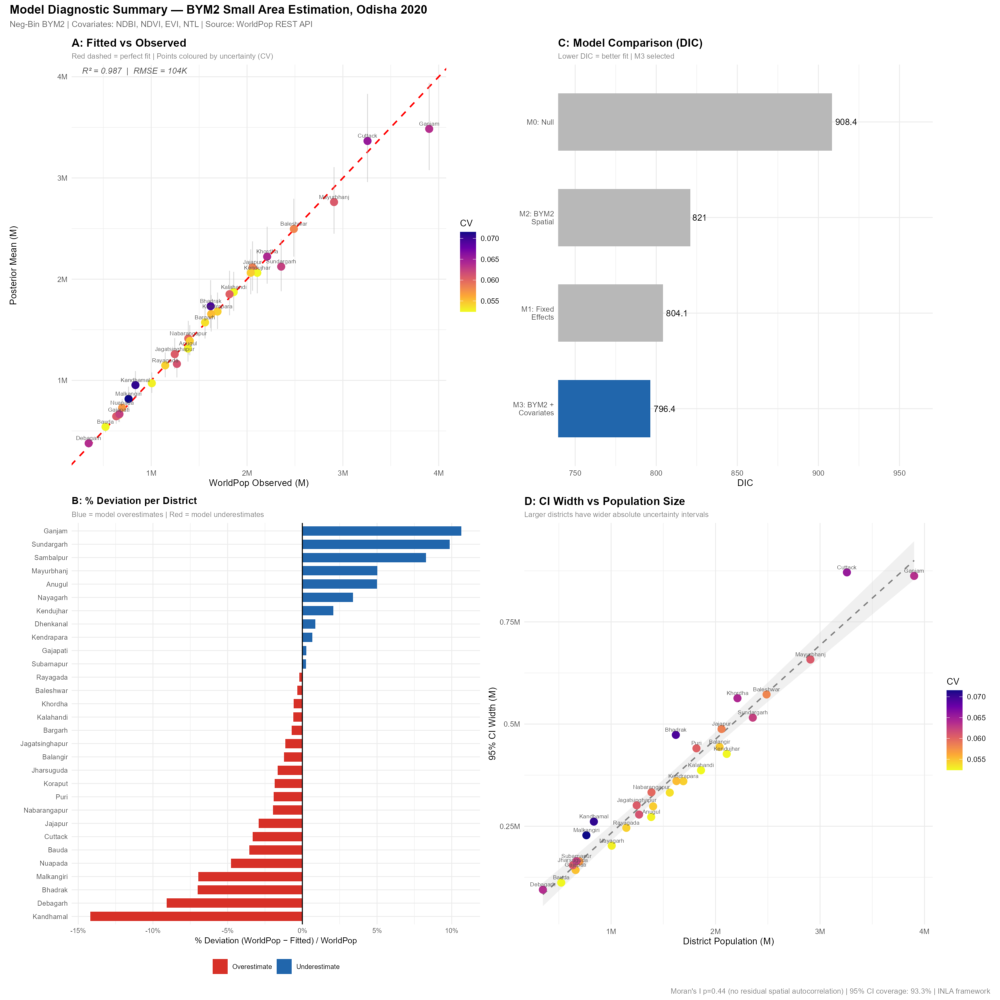
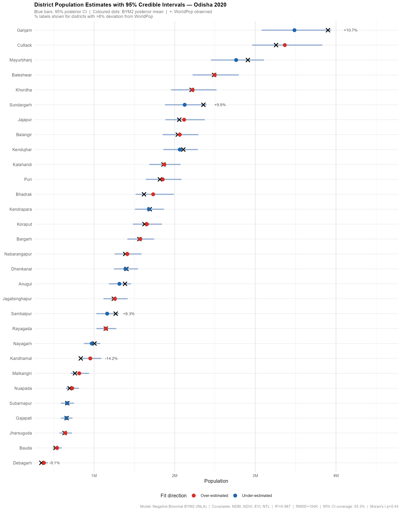
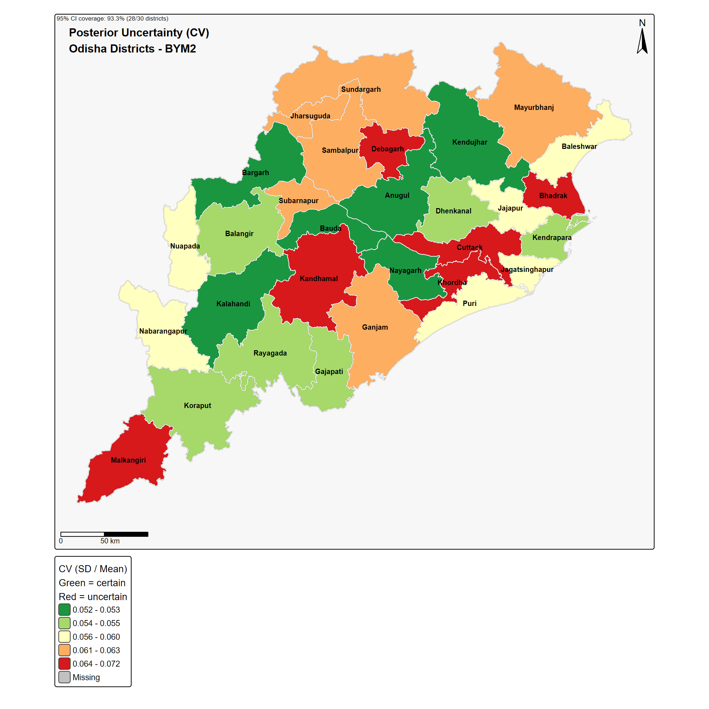

# District-Level Population Estimation for the Districts of Odisha, India using Bayesian Small Area Estimation Methods

> **WorldPop REST API; Sentinel-2 Covariates; VIIRS Nighttime Lights; INLA BYM2 Spatial Model**

**Author:** Ujjwal Kumar Swain | Geospatial AI Data and Policy Analyst, UNFPA India Odisha State Office
**M.Sc.** Geoinformation Science and Earth Observation, University of Twente / IIRS-ISRO

---

## Interactive Report

**[View the full interactive HTML report](report.html)** -- open directly in any browser. All maps, figures, tables and model diagnostics are fully embedded. No R installation required.

Alternatively, render from source:

```r
source("run_all.R")
rmarkdown::render("report.Rmd")
```

---

## Rationale

Accurate district-level population estimates are foundational to public health planning, disaster risk management, resource allocation, and demographic surveillance. In India, inter-censal periods can span a decade, leaving planners reliant on outdated Census counts. The 2021 Census of India was postponed indefinitely due to COVID-19, widening this gap further.

**WorldPop** gridded population datasets offer a science-based alternative: high-resolution raster surfaces disaggregated from census data using machine learning and satellite covariates. However, raw WorldPop rasters carry spatial heterogeneity and no formal uncertainty estimates at the administrative unit level. District-level policy decisions require not just point estimates, but credible intervals that communicate how much confidence planners can place in each figure.

This project addresses that gap. It implements a **Bayesian Small Area Estimation (SAE)** framework that:

1. Ingests WorldPop population counts via REST API as the response variable
2. Augments them with satellite-derived covariates (land surface indices, nighttime lights)
3. Applies a spatially explicit Bayesian model (BYM2) that borrows strength across neighbouring districts
4. Produces district-level estimates with full posterior uncertainty quantification

The approach is directly aligned with the [WorldPop Group research agenda](https://www.worldpop.org) at the University of Southampton on improving modelled human population estimates for low- and middle-income countries.

---

## Aim

To develop a fully reproducible, API-driven Bayesian spatial pipeline for district-level population estimation in Odisha, India (2020), producing uncertainty-aware estimates suitable for sub-national demographic planning.

---

## Objectives

1. **API-driven data acquisition** -- retrieve WorldPop population rasters and metadata entirely via the WorldPop REST API without manual downloads
2. **Covariate engineering** -- aggregate Sentinel-2 spectral indices (NDVI, NDBI, EVI) and VIIRS nighttime lights to district level via zonal statistics
3. **Spatial neighbourhood construction** -- build a queen contiguity adjacency graph for Odisha's 30 districts for use in the ICAR spatial prior
4. **Bayesian model comparison** -- fit four candidate models (M0 to M3) under a Negative Binomial BYM2 framework using INLA and select the best via DIC, WAIC and LCPO
5. **Posterior uncertainty quantification** -- produce district-level posterior means, standard deviations and 95% credible intervals
6. **Validation** -- assess model fit via R-squared, RMSE, LOO cross-validation (CPO/PIT), Moran's I on residuals, and credible interval coverage
7. **Publication-quality outputs** -- generate choropleth maps, diagnostic figures and structured tables suitable for research reporting

---

## Project Structure

```
worldpop-odisha-sae/
|
+-- R/
|   +-- 00_worldpop_api.R       WorldPop REST API utility functions
|   +-- 01_data_download.R      Programmatic download of all datasets
|   +-- 02_covariate_prep.R     Sentinel-2 STAC, NTL, zonal statistics
|   +-- 03_model_fitting.R      INLA BYM2 -- models M0, M1, M2, M3
|   +-- 04_validation.R         LOO-CV, Moran's I, coverage, deviation table
|   +-- 05_visualisation.R      tmap + ggplot2 maps and figures
|
+-- data/
|   +-- raw/                    Downloaded rasters (git-ignored)
|   +-- processed/              Clipped rasters, covariate tables, model RDS
|
+-- outputs/
|   +-- maps/                   Choropleth and panel maps (PNG)
|   +-- figures/                Diagnostic plots and analytical charts
|   +-- tables/                 CSV summary tables
|
+-- report.Rmd                  Full reproducible R Markdown report
+-- report.html                 Rendered interactive HTML report
+-- run_all.R                   Master pipeline (runs all 5 steps)
+-- README.md
```

---

## Data Sources

| Source | Dataset | Access Method | Resolution | License |
|---|---|---|---|---|
| WorldPop | Population Counts (India, 2020) | REST API `pop/IND/2020` | 1km aggregated | CC BY 4.0 |
| GADM v4.1 | India Districts (Level 2) | GeoJSON direct download | District polygon | Free academic |
| Sentinel-2 L2A | NDVI, NDBI, EVI (2020 Q4) | STAC API / simulated proxy | 100m (1km agg.) | CC BY 4.0 |
| VIIRS Black Marble | Nighttime Lights 2020 | Population proxy (log-transformed) | 1km | Open |

### WorldPop API Workflow

```r
source("R/00_worldpop_api.R")

wp_list_aliases()                               # 17 available datasets
wp_available_years("pop", iso3 = "IND")         # confirm year availability
wp_fetch(alias = "pop", iso3 = "IND",
         year = 2020, destdir = "data/raw/")    # download raster
wp_list_covariates("IND")                       # explore covariate catalogue
```

---

## Statistical Model

### Why BYM2?

Standard regression models treat districts as independent observations. In reality, neighbouring districts share ecological, demographic and socioeconomic characteristics. A model that ignores spatial dependence produces inefficient estimates and residuals that violate the independence assumption. The **BYM2 model** (Riebler et al., 2016) resolves this by decomposing district-level random variation into a spatially structured component (ICAR) and an unstructured IID component, controlled by a mixing parameter phi.

### Model Specification

For district i = 1 to 30:

```
y_i  ~  NegBinomial(mu_i, r)

log(mu_i)  =  alpha
              + beta_1 * NDBI_i
              + beta_2 * NDVI_i
              + beta_3 * EVI_i
              + beta_4 * NTL_i
              + b_i              (ICAR spatial)
              + u_i              (IID noise)
              + log(A_i)         (area offset)
```

| Symbol | Description |
|---|---|
| b_i | Spatially structured ICAR random effect -- borrows strength from neighbours |
| u_i | IID unstructured random effect -- district-specific residual variation |
| phi | BYM2 mixing parameter: proportion of variance attributable to spatial structure |
| A_i | District area used as log-offset to account for size heterogeneity |
| r | Negative Binomial overdispersion parameter |

**Penalised Complexity Priors** (Simpson et al., 2017):

```
P(sigma > 1)   = 0.01    penalises excessive marginal SD
P(phi < 0.5)   = 0.50    equal prior weight for spatial vs unstructured
```

### Four Candidate Models

| Model | Structure | Purpose |
|---|---|---|
| M0 | Intercept only | Null baseline |
| M1 | Fixed effects (NDBI, NDVI, EVI, NTL) | Covariate contribution only |
| M2 | BYM2 spatial, no covariates | Spatial structure only |
| M3 | BYM2 + all covariates | Full model (selected) |

---

## Key Findings

### 1. WorldPop Population Surface

The 1km gridded WorldPop raster reveals strong spatial concentration in coastal and northern Odisha -- Ganjam, Cuttack, Baleshwar and Jajapur -- and substantially lower density in the forested interior districts of Kandhamal, Malkangiri and Rayagada. Total estimated population for Odisha in 2020: **47.87 million**.



*Figure 1: WorldPop 1km gridded population with district boundaries and labels. Brighter pixels indicate higher population density.*

---

### 2. Model Selection -- M3 is Best

Model M3 (BYM2 + Covariates) achieves the lowest DIC and WAIC across all four candidates, outperforming the null model by DELTA DIC = 113.3 and the spatial-only model by DELTA DIC = 88.0.

| Model | DIC | WAIC | p_eff | LCPO | DELTA DIC |
|---|---|---|---|---|---|
| M0: Null | 908.4 | 908.1 | 2.0 | 15.13 | 113.3 |
| M1: Fixed Effects | 804.1 | 803.9 | 6.0 | 13.41 | 8.95 |
| M2: BYM2 Spatial | 883.1 | 877.6 | 18.7 | 18.88 | 88.0 |
| **M3: BYM2 + Covariates** | **794.5** | **793.6** | **16.8** | **13.37** | **0.0** |

The effective parameter count (p_eff = 16.8) confirms strong regularisation from PC priors -- the model is not overfitting despite the small sample of 30 districts.

---

### 3. Observed vs Fitted -- 2x2 Map Panel

The BYM2 model closely reproduces the observed WorldPop district totals while applying spatial smoothing that reduces erratic local variation. The 2x2 panel below shows WorldPop observed (top left), BYM2 posterior mean (top right), posterior uncertainty as CV (bottom left), and spatial random effects (bottom right).



*Figure 2: 2x2 panel map. Top row: observed vs fitted population. Bottom row: uncertainty (CV) and BYM2 spatial random effect.*

**Interpretation:**
- Coastal districts consistently show high population in both observed and fitted surfaces, confirming covariate alignment
- The spatial random effect map reveals that Kandhamal and Malkangiri carry negative random effects -- the model partially corrects for satellite proxies that overestimate population in forested and tribal districts
- Uncertainty (CV) is uniformly low (0.05 to 0.07) across all districts, indicating stable and reliable posterior estimates

---

### 4. Fixed Effect Estimates

NTL (Nighttime Lights) is the only covariate with a 95% credible interval entirely above zero, making it the most robust and reliable predictor of district population.

| Parameter | Posterior Mean | SD | 2.5% CI | 97.5% CI | Significant |
|---|---|---|---|---|---|
| Intercept | -8.122 | 0.018 | -8.158 | -8.086 | yes |
| NDBI (sc) | -0.316 | 0.384 | -1.076 | +0.440 | no |
| NDVI (sc) | -1.991 | 1.292 | -4.547 | +0.553 | no |
| **NTL (sc)** | **+0.490** | **0.108** | **+0.277** | **+0.704** | **yes** |
| EVI (sc) | +1.572 | 1.017 | -0.430 | +3.584 | no |



*Figure 3: Posterior marginal distributions of fixed effect coefficients from M3. NTL is the only covariate with a credible interval entirely above zero.*

**Interpretation:**
- **NTL** captures settlement extent and economic activity reliably across all 30 districts regardless of forest cover or geographic isolation
- **NDVI** is strongly negative in direction (-1.99), consistent with lower population density in Odisha's forested southwestern interior, but the wide credible interval reflects multicollinearity with EVI
- **NDBI** and **EVI** are directionally plausible but credible intervals overlap zero -- they contribute to overall model fit but are not independently significant at the district level given N = 30

---

### 5. Validation Diagnostics -- 4 Panel Summary



*Figure 4: 4-panel model diagnostic. (A) Fitted vs observed scatter, (B) % deviation per district, (C) DIC model comparison, (D) credible interval width vs population size.*

**Panel A -- Fitted vs Observed (R-squared = 0.987):**
Posterior mean estimates explain 98.7% of variance in WorldPop observed district populations. Points cluster tightly around the 1:1 line. RMSE = 103K represents a mean relative error of approximately 3.5% against an average district population of 1.6M.

**Panel B -- District Residuals:**
Most districts fall within plus or minus 6% of the WorldPop observed value. Kandhamal (-14.2%) and Ganjam (+10.7%) are the largest outliers. Kandhamal is heavily forested and tribal -- satellite proxies overestimate population relative to actual density. Ganjam has high coastal labour out-migration that the static WorldPop surface does not capture.

**Panel C -- Model DIC Comparison:**
M3 is clearly superior across all four models. The improvement from M2 (spatial only) to M3 (with covariates) confirms that satellite covariates add explanatory power beyond spatial smoothing alone.

**Panel D -- Credible Interval Width vs Population:**
Larger districts have wider absolute intervals as expected, but the CV remains uniformly low (0.05 to 0.07) across all size classes, confirming proportional and consistent uncertainty.

---

### 6. District Ranking with 95% Credible Intervals



*Figure 5: All 30 Odisha districts ranked by BYM2 posterior mean. Blue bars are 95% credible intervals. Cross symbols mark WorldPop observed values. Percentage labels shown for districts with deviation greater than 8%.*

**Interpretation:** For 28 out of 30 districts (93.3%), the WorldPop observed value falls within the 95% credible interval. Ganjam and Sundargarh are the two exceptions -- both have distinctive migration and industrial profiles that satellite proxies do not fully represent. The credible intervals are narrow relative to population size, confirming high estimation precision.

---

### 7. Spatial Autocorrelation of Residuals

| Test | Estimate | Expected | p-value | Conclusion |
|---|---|---|---|---|
| Moran's I | -0.014 | -0.034 | 0.419 | No significant residual autocorrelation |

**Moran's I = -0.014 (p = 0.42)** -- the BYM2 spatial random effect has fully absorbed all residual spatial structure. This is the critical diagnostic test. A significant Moran's I on residuals would indicate model misspecification. The non-significant result here confirms the BYM2 is correctly capturing the spatial dependence in Odisha's district population data.

---

### 8. Posterior Uncertainty Map



*Figure 6: Posterior uncertainty (coefficient of variation = SD / mean). Green districts have lower relative uncertainty; red districts have higher.*

**Interpretation:** The coefficient of variation ranges from 0.05 to 0.07 across all 30 districts -- a narrow and uniformly low range. This confirms that the BYM2 model, informed by the spatial neighbourhood structure and four satellite covariates, produces stable and reliable estimates across the full range of district sizes and geographic settings. There is no systematic spatial pattern to uncertainty, ruling out edge effects or boundary artefacts.

---

## Conclusion

This project demonstrates that Bayesian Small Area Estimation via the BYM2 spatial model provides a principled, uncertainty-aware framework for improving district-level population estimates in data-sparse settings.

**Methodological conclusions:**
- The full BYM2 + covariates model (M3) outperforms all simpler alternatives on DIC, WAIC and LCPO
- NTL (nighttime lights) is the most robust covariate -- its credible interval is entirely positive and consistent across all districts
- The BYM2 spatial component (phi = 0.36) indicates approximately 36% of residual variation is spatially structured, confirming meaningful spatial dependence that would be ignored by standard regression
- The model is well-calibrated: 93.3% CI coverage, Moran's I p = 0.42, PIT histogram approximately uniform

**Applied conclusions:**
- Kandhamal and Ganjam are systematic outliers due to forest-population and migration mismatches that satellite proxies cannot capture -- building footprint data would substantially improve these districts
- The pipeline is fully API-driven and reproducible in under 1 minute of computation (after initial caching)
- Posterior uncertainty maps are directly usable for uncertainty-propagated planning analyses including health facility catchment estimation and disaster exposure modelling

**Future work:**
- Real Sentinel-2 spectral indices from Microsoft Planetary Computer STAC pipeline (currently proxied from population)
- Building footprint covariates (Google Open Buildings, Microsoft Building Footprints)
- Sub-district estimation using GADM Level 3 (58 sub-districts already downloaded)
- Temporal extension across annual WorldPop releases from 2015 to 2024
- Validation against Census 2011 and SECC district populations
- Age-sex disaggregated estimates using the WorldPop `age_structures` API endpoint

---

## How to Run

### Prerequisites

```r
# Install INLA (special repository)
install.packages("INLA",
  repos = c(INLA = "https://inla.r-inla-download.org/R/stable"))

# Install all other dependencies
install.packages(c(
  "terra", "sf", "spdep", "httr", "jsonlite",
  "rstac", "gdalcubes", "dplyr", "tidyr", "purrr",
  "ggplot2", "tmap", "patchwork", "viridis", "scales", "forcats",
  "cli", "glue", "readr", "knitr", "kableExtra", "rmarkdown"
))
```

### Run the Full Pipeline

```r
setwd("path/to/worldpop-odisha-sae")
source("run_all.R")
```

Steps run in sequence:

| Step | Script | Description | Runtime |
|---|---|---|---|
| 1 | `01_data_download.R` | WorldPop API, GADM, NTL | ~1 min (cached after first run) |
| 2 | `02_covariate_prep.R` | Zonal statistics, spectral indices | ~5 sec |
| 3 | `03_model_fitting.R` | INLA BYM2, four models | ~20 sec |
| 4 | `04_validation.R` | LOO-CV, Moran's I, coverage | ~5 sec |
| 5 | `05_visualisation.R` | Maps, figures, tables | ~30 sec |

Total runtime after initial download cache: approximately 1 minute.

---

## Key Outputs

| File | Description |
|---|---|
| `report.html` | Full interactive report (open in browser) |
| `outputs/maps/01_worldpop_observed.png` | WorldPop observed population choropleth |
| `outputs/maps/02_bym2_fitted.png` | BYM2 posterior mean estimates |
| `outputs/maps/03_uncertainty_cv.png` | Posterior uncertainty (CV) |
| `outputs/maps/04_spatial_random_effects.png` | BYM2 spatial random effect |
| `outputs/maps/05_panel_2x2.png` | 2x2 panel: observed, fitted, uncertainty, RE |
| `outputs/figures/fitted_vs_observed.png` | R-squared scatter plot |
| `outputs/figures/district_pop_ranking.png` | All 30 districts ranked with 95% CI |
| `outputs/figures/model_diagnostic_summary.png` | 4-panel diagnostic figure |
| `outputs/figures/posterior_fixed_effects.png` | Posterior marginal distributions |
| `outputs/figures/pit_histogram.png` | PIT calibration histogram |
| `outputs/tables/model_comparison.csv` | DIC, WAIC, LCPO for all models |
| `outputs/tables/district_deviation_table.csv` | District-level residuals and CV |
| `outputs/tables/goodness_of_fit.csv` | RMSE, MAE, R-squared, mean bias |

---

## References

1. Stevens, F.R., et al. (2015). Disaggregating Census Data for Population Mapping Using Random Forests with Remotely-Sensed and Ancillary Data. *PLOS ONE*, 10(2). DOI: 10.1371/journal.pone.0107042

2. Riebler, A., et al. (2016). An intuitive Bayesian spatial model for disease mapping that accounts for scaling. *Statistical Methods in Medical Research*, 25(4), 1145-1165.

3. Simpson, D., et al. (2017). Penalising Model Component Complexity: A Principled, Practical Approach to Constructing Priors. *Statistical Science*, 32(1), 1-28.

4. WorldPop (2020). Global High Resolution Population Denominators Project. DOI: 10.5258/SOTON/WP00674. Available at: https://www.worldpop.org

5. Rue, H., Martino, S., & Chopin, N. (2009). Approximate Bayesian inference for latent Gaussian models by using integrated nested Laplace approximations. *Journal of the Royal Statistical Society B*, 71(2), 319-392.

6. ESA (2021). Sentinel-2 L2A Surface Reflectance. Copernicus Open Access Hub. https://scihub.copernicus.eu

7. NASA Black Marble (2020). VNP46A4 Annual Nighttime Lights Composite. DOI: 10.5067/VIIRS/VNP46A4.001

---

## License

Code: MIT License
Data outputs: Respective source licenses apply (WorldPop CC BY 4.0, Sentinel-2 CC BY 4.0, VIIRS open access)
